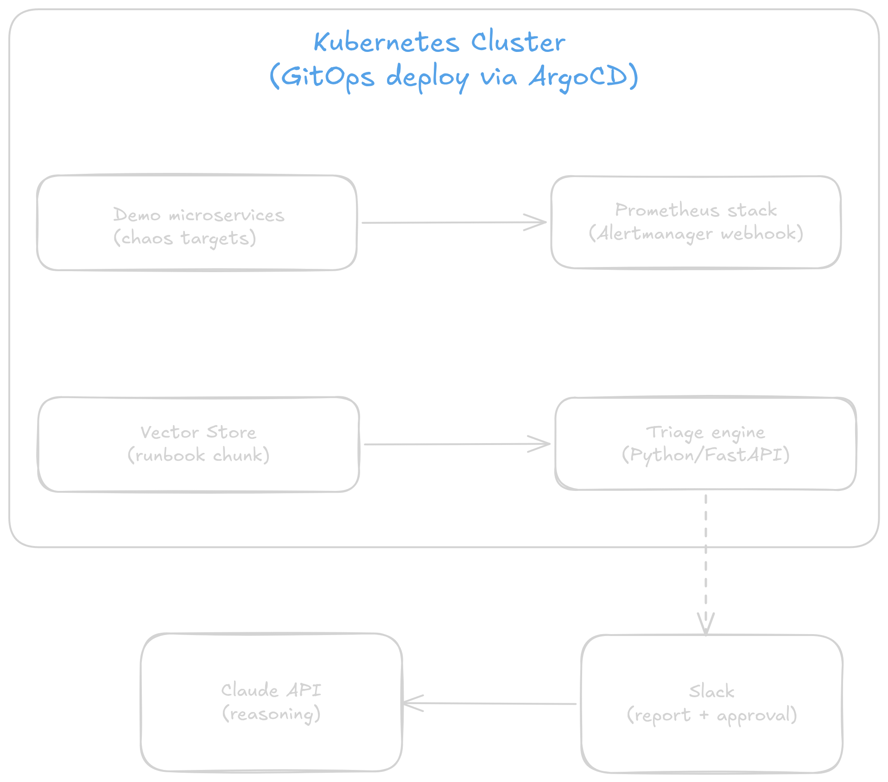

# triage-copilot

An LLM-powered incident triage assistant for Kubernetes. When a Prometheus alert fires, triage-copilot enriches it with live cluster state, retrieves the relevant runbook via RAG, generates a root-cause hypothesis and remediation plan with the Claude API, and delivers a structured triage report to Slack - with human-approved auto-remediation.

**Tech stack:** Python · Go · Kubernetes · ArgoCD (GitOps) · Prometheus · Grafana · OpenTelemetry · Chaos Mesh · Claude API · RAG (pgvector) · FastAPI · Docker

## Architecture



## Quickstart (Beta)

**Prerequisites:** Docker, kind, kubectl, make

```bash
# 1. Clone the repo
git clone https://github.com/YOUR_GITHUB_USERNAME/triage-copilot.git
cd triage-copilot

# 2. Create cluster, install ArgoCD, deploy everything
make up

# 3. Open the UIs
#    ArgoCD:  https://localhost:8080  (admin / <run: make argocd-password>)
#    Grafana: http://localhost:3000   (admin / prom-operator)

# 4. Run a chaos experiment (once Phase 3 is built)
make chaos-pod-kill

# 5. Watch the triage report land in Slack
make logs-triage

# 6. Tear down
make down
```

## Design decisions

These are intentional trade-offs, not defaults - the kind of reasoning an architect does.

| Decision | Rationale |
|---|---|
| **Human-in-the-loop remediation** | The LLM proposes; a human approves. Mutating actions (restart, scale, rollback) are whitelisted - the LLM cannot generate arbitrary kubectl commands. This is the safety boundary. |
| **pgvector over a dedicated vector DB** | One Postgres instance serves both vector search and incident history. Fewer moving parts, transactional consistency between embedding and record writes. At this scale a dedicated vector DB adds complexity without benefit. |
| **Enrichment → Retrieval → Generation** | The LLM sees live evidence (pod status, metrics, logs), not just the alert string. Grounding reduces hallucinated root causes. The retrieval step adds runbook SOPs so recommendations are org-specific. |
| **Structured JSON output** | The triage result is machine-consumable. Slack formatting, remediation dispatch, and dashboards all consume the same schema, no LLM prose parsing. |
| **GitOps app-of-apps** | The entire platform is declarative. Disaster recovery = `argocd app sync` on a fresh cluster. Timed recovery is a measurable SRE metric. |
| **Chaos ↔ Alert ↔ Runbook triads** | Every chaos experiment maps to exactly one alert rule and one runbook. This makes the system testable and the demo reproducible. |

## License

MIT
